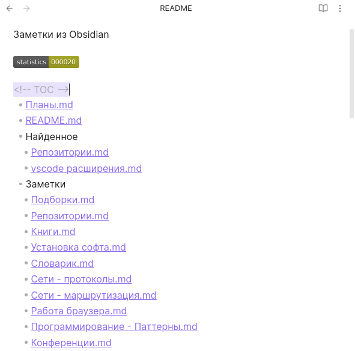

# Obsidian files table of contents


Obsidian plugin for generating TOC for files

- Create file example `READEME.md`
- Add file in settings
- Add to file this block
```
<!-- TOC -->
<!-- TOC -->
```

